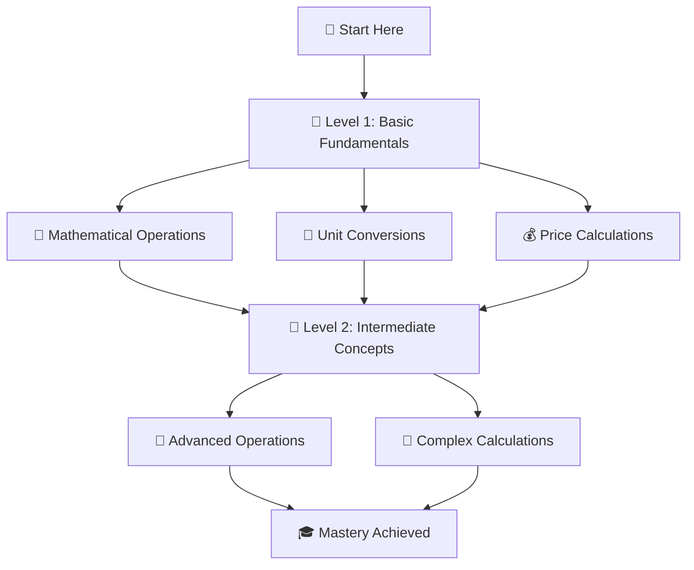

# 🎓 BridgeLab SIPP Training

<div align="center">


**A comprehensive Java programming training repository from BridgeLab SIPP Program**

</div>

## 📚 Course Overview

This repository contains Java programming exercises and projects organized into two progressive levels, designed to build fundamental programming skills from basic calculations to more complex operations.

### 🔗 Quick Navigation
- 📘 [Level 1 - Basic Programming](#-level-1---basic-programming-fundamentals) | [📁 Browse Level 1 Files](https://github.com/aum2357/BridgeLab-SIPP-Training/tree/main/level1)
- 📗 [Level 2 - Intermediate Programming](#-level-2---intermediate-programming-concepts) | [📁 Browse Level 2 Files](https://github.com/aum2357/BridgeLab-SIPP-Training/tree/main/level2)
- 🛠️ [Getting Started Guide](#%EF%B8%8F-getting-started)
- 📈 [Learning Path](#-learning-path)
- 🎯 [Learning Objectives](#-learning-objectives)
- 🤝 [How to Contribute](#-contributing)

---

## 🚀 Training Levels

### 📘 Level 1 - Basic Programming Fundamentals

> 🎯 **Focus**: Mathematical calculations, unit conversions, and basic Java syntax  
> 📊 **Difficulty**: Beginner  
> ⏱️ **Estimated Time**: 2-3 weeks  
> 🔗 **Directory**: [📁 /level1](https://github.com/aum2357/BridgeLab-SIPP-Training/tree/main/level1)

<details>
<summary><b>Click to expand Level 1 topics (16 exercises)</b></summary>

#### 🧮 Mathematical Operations
| 🔢 Topic | 📝 Description | 🔗 Source Code | 📋 View Code |
|----------|----------------|----------------|--------------|
| **Age Finder** | Calculate and determine age-related logic | [📄 AgeFinder.java](https://github.com/aum2357/BridgeLab-SIPP-Training/blob/main/level1/AgeFinder.java) | [👁️ Preview](https://github.com/aum2357/BridgeLab-SIPP-Training/blob/main/level1/AgeFinder.java) |
| **Average PCM** | Calculate average of Physics, Chemistry, and Mathematics | [📄 AveragePCM.java](https://github.com/aum2357/BridgeLab-SIPP-Training/blob/main/level1/AveragePCM.java) | [👁️ Preview](https://github.com/aum2357/BridgeLab-SIPP-Training/blob/main/level1/AveragePCM.java) |
| **Calculator** | Basic arithmetic operations (+, -, *, /) | [📄 Calculator.java](https://github.com/aum2357/BridgeLab-SIPP-Training/blob/main/level1/Calculator.java) | [�️ Preview](https://github.com/aum2357/BridgeLab-SIPP-Training/blob/main/level1/Calculator.java) |
| **Earth Volume** | Calculate volume of Earth using mathematical formulas | [📄 EarthVolume.java](https://github.com/aum2357/BridgeLab-SIPP-Training/blob/main/level1/EarthVolume.java) | [👁️ Preview](https://github.com/aum2357/BridgeLab-SIPP-Training/blob/main/level1/EarthVolume.java) |
| **Max Handshakes** | Calculate maximum possible handshakes in a group | [📄 MaxHandShakes.java](https://github.com/aum2357/BridgeLab-SIPP-Training/blob/main/level1/MaxHandShakes.java) | [👁️ Preview](https://github.com/aum2357/BridgeLab-SIPP-Training/blob/main/level1/MaxHandShakes.java) |
| **Triangle Area** | Calculate area of triangles using different methods | [📄 TringleArea.java](https://github.com/aum2357/BridgeLab-SIPP-Training/blob/main/level1/TringleArea.java) | [👁️ Preview](https://github.com/aum2357/BridgeLab-SIPP-Training/blob/main/level1/TringleArea.java) |
| **Square Side** | Calculate side length of a square from area | [📄 SquareSide.java](https://github.com/aum2357/BridgeLab-SIPP-Training/blob/main/level1/SquareSide.java) | [👁️ Preview](https://github.com/aum2357/BridgeLab-SIPP-Training/blob/main/level1/SquareSide.java) |

#### 📏 Unit Conversion & Measurements
| 🔢 Topic | 📝 Description | 🔗 Source Code | 📋 View Code |
|----------|----------------|----------------|--------------|
| **Feet Converter** | Convert measurements from feet to other units | [📄 FeetConverter.java](https://github.com/aum2357/BridgeLab-SIPP-Training/blob/main/level1/FeetConverter.java) | [👁️ Preview](https://github.com/aum2357/BridgeLab-SIPP-Training/blob/main/level1/FeetConverter.java) |
| **Height Converter** | Convert height between different units (ft, in, cm) | [📄 HeightConverter.java](https://github.com/aum2357/BridgeLab-SIPP-Training/blob/main/level1/HeightConverter.java) | [👁️ Preview](https://github.com/aum2357/BridgeLab-SIPP-Training/blob/main/level1/HeightConverter.java) |
| **Km to Miles** | Distance conversion from kilometers to miles | [📄 KmToMiles.java](https://github.com/aum2357/BridgeLab-SIPP-Training/blob/main/level1/KmToMiles.java) | [👁️ Preview](https://github.com/aum2357/BridgeLab-SIPP-Training/blob/main/level1/KmToMiles.java) |
| **Km to Miles Input** | Interactive distance converter with user input | [📄 KmToMilesInput.java](https://github.com/aum2357/BridgeLab-SIPP-Training/blob/main/level1/KmToMilesInput.java) | [👁️ Preview](https://github.com/aum2357/BridgeLab-SIPP-Training/blob/main/level1/KmToMilesInput.java) |

#### 💰 Financial Calculations & Business Logic
| 🔢 Topic | 📝 Description | 🔗 Source Code | 📋 View Code |
|----------|----------------|----------------|--------------|
| **Course Fee Discount** | Calculate discounts on course fees | [📄 CourseFeeDiscount.java](https://github.com/aum2357/BridgeLab-SIPP-Training/blob/main/level1/CourseFeeDiscount.java) | [👁️ Preview](https://github.com/aum2357/BridgeLab-SIPP-Training/blob/main/level1/CourseFeeDiscount.java) |
| **Fee Discount Input** | Interactive fee discount calculator with user input | [📄 FeeDiscountInput.java](https://github.com/aum2357/BridgeLab-SIPP-Training/blob/main/level1/FeeDiscountInput.java) | [👁️ Preview](https://github.com/aum2357/BridgeLab-SIPP-Training/blob/main/level1/FeeDiscountInput.java) |
| **Profit Calculator** | Calculate profit and loss scenarios | [📄 ProfitCalc.java](https://github.com/aum2357/BridgeLab-SIPP-Training/blob/main/level1/ProfitCalc.java) | [�️ Preview](https://github.com/aum2357/BridgeLab-SIPP-Training/blob/main/level1/ProfitCalc.java) |
| **Total Price** | Calculate total price with taxes and discounts | [📄 TotalPrice.java](https://github.com/aum2357/BridgeLab-SIPP-Training/blob/main/level1/TotalPrice.java) | [👁️ Preview](https://github.com/aum2357/BridgeLab-SIPP-Training/blob/main/level1/TotalPrice.java) |

#### 🎲 Problem Solving & Logic
| 🔢 Topic | 📝 Description | 🔗 Source Code | 📋 View Code |
|----------|----------------|----------------|--------------|
| **Pen Distribution** | Solve pen distribution optimization problems | [📄 PenDistribution.java](https://github.com/aum2357/BridgeLab-SIPP-Training/blob/main/level1/PenDistribution.java) | [👁️ Preview](https://github.com/aum2357/BridgeLab-SIPP-Training/blob/main/level1/PenDistribution.java) |

📚 **Level 1 Resources**:
- [📁 Browse All Level 1 Files](https://github.com/aum2357/BridgeLab-SIPP-Training/tree/main/level1)
- [📊 Level 1 Commit History](https://github.com/aum2357/BridgeLab-SIPP-Training/commits/main/level1)
- [🔍 Search Level 1 Code](https://github.com/aum2357/BridgeLab-SIPP-Training/search?q=path%3Alevel1)

</details>

### 📗 Level 2 - Intermediate Programming Concepts

> 🎯 **Focus**: Advanced calculations, data type handling, and complex operations  
> 📊 **Difficulty**: Intermediate  
> ⏱️ **Estimated Time**: 3-4 weeks  
> 🔗 **Directory**: [📁 /level2](https://github.com/aum2357/BridgeLab-SIPP-Training/tree/main/level2)

<details>
<summary><b>Click to expand Level 2 topics (8 advanced exercises)</b></summary>

#### 🔢 Advanced Mathematical Operations
| 🔢 Topic | 📝 Description | 🔗 Source Code | 📋 View Code | 🎯 Concepts |
|----------|----------------|----------------|--------------|-------------|
| **Basic Calculator** | Enhanced calculator with advanced operations | [📄 BasicCalculator.java](https://github.com/aum2357/BridgeLab-SIPP-Training/blob/main/level2/BasicCalculator.java) | [👁️ Preview](https://github.com/aum2357/BridgeLab-SIPP-Training/blob/main/level2/BasicCalculator.java) | Functions, Methods |
| **Double Operations** | Mathematical operations with double precision | [📄 DoubleOperation.java](https://github.com/aum2357/BridgeLab-SIPP-Training/blob/main/level2/DoubleOperation.java) | [�️ Preview](https://github.com/aum2357/BridgeLab-SIPP-Training/blob/main/level2/DoubleOperation.java) | Double datatype, Precision |
| **Integer Operations** | Various integer mathematical operations | [📄 IntOperation.java](https://github.com/aum2357/BridgeLab-SIPP-Training/blob/main/level2/IntOperation.java) | [👁️ Preview](https://github.com/aum2357/BridgeLab-SIPP-Training/blob/main/level2/IntOperation.java) | Integer operations |
| **Quotient & Remainder** | Division operations with quotient and remainder | [📄 QuotientAndRemainder.java](https://github.com/aum2357/BridgeLab-SIPP-Training/blob/main/level2/QuotientAndRemainder.java) | [👁️ Preview](https://github.com/aum2357/BridgeLab-SIPP-Training/blob/main/level2/QuotientAndRemainder.java) | Modulo, Division |

#### 📏 Advanced Unit Conversions
| 🔢 Topic | 📝 Description | 🔗 Source Code | 📋 View Code | 🎯 Concepts |
|----------|----------------|----------------|--------------|-------------|
| **Feet to Yards & Miles** | Multi-unit distance conversion system | [📄 FeetToYardsMiles.java](https://github.com/aum2357/BridgeLab-SIPP-Training/blob/main/level2/FeetToYardsMiles.java) | [👁️ Preview](https://github.com/aum2357/BridgeLab-SIPP-Training/blob/main/level2/FeetToYardsMiles.java) | Multiple conversions |

#### 🔺 Geometry & Advanced Calculations
| 🔢 Topic | 📝 Description | 🔗 Source Code | 📋 View Code | 🎯 Concepts |
|----------|----------------|----------------|--------------|-------------|
| **Square Side from Perimeter** | Calculate square side from given perimeter | [📄 SquareSideFromPerimeter.java](https://github.com/aum2357/BridgeLab-SIPP-Training/blob/main/level2/SquareSideFromPerimeter.java) | [👁️ Preview](https://github.com/aum2357/BridgeLab-SIPP-Training/blob/main/level2/SquareSideFromPerimeter.java) | Reverse calculations |
| **Triangle Area Conversion** | Advanced triangle area calculations with conversions | [📄 TriangleAreaConversion.java](https://github.com/aum2357/BridgeLab-SIPP-Training/blob/main/level2/TriangleAreaConversion.java) | [👁️ Preview](https://github.com/aum2357/BridgeLab-SIPP-Training/blob/main/level2/TriangleAreaConversion.java) | Complex geometry |

#### 💰 Advanced Financial Systems
| 🔢 Topic | 📝 Description | 🔗 Source Code | 📋 View Code | 🎯 Concepts |
|----------|----------------|----------------|--------------|-------------|
| **Total Price Calculator** | Advanced price calculation system with multiple factors | [📄 TotalPriceCalculator.java](https://github.com/aum2357/BridgeLab-SIPP-Training/blob/main/level2/TotalPriceCalculator.java) | [👁️ Preview](https://github.com/aum2357/BridgeLab-SIPP-Training/blob/main/level2/TotalPriceCalculator.java) | Complex pricing logic |

📚 **Level 2 Resources**:
- [📁 Browse All Level 2 Files](https://github.com/aum2357/BridgeLab-SIPP-Training/tree/main/level2)
- [📊 Level 2 Commit History](https://github.com/aum2357/BridgeLab-SIPP-Training/commits/main/level2)
- [🔍 Search Level 2 Code](https://github.com/aum2357/BridgeLab-SIPP-Training/search?q=path%3Alevel2)
- [📈 Compare Level 1 vs Level 2](https://github.com/aum2357/BridgeLab-SIPP-Training/compare/main...main)

</details>

---

## 🛠️ Getting Started

### Prerequisites
- ☕ **Java Development Kit (JDK) 8 or higher** - [📥 Download JDK](https://www.oracle.com/java/technologies/downloads/)
- 💻 **Java IDE** (Choose one):
  - [🌙 Eclipse IDE](https://www.eclipse.org/downloads/) - Free, popular Java IDE
  - [🧠 IntelliJ IDEA](https://www.jetbrains.com/idea/) - Professional Java development
  - [⚡ VS Code](https://code.visualstudio.com/) with [Java Extension Pack](https://marketplace.visualstudio.com/items?itemName=vscjava.vscode-java-pack)
  - [☀️ NetBeans](https://netbeans.apache.org/) - Apache NetBeans IDE
- 📚 **Basic understanding of programming concepts** - [📖 Java Basics Tutorial](https://docs.oracle.com/javase/tutorial/java/nutsandbolts/)

### 🚀 Quick Setup Guide

#### 1️⃣ Clone the Repository
```bash
# Using HTTPS
git clone https://github.com/aum2357/BridgeLab-SIPP-Training.git

# Using SSH (if you have SSH keys set up)
git clone git@github.com:aum2357/BridgeLab-SIPP-Training.git

# Using GitHub CLI
gh repo clone aum2357/BridgeLab-SIPP-Training
```

#### 2️⃣ Navigate to Project Directory
```bash
cd BridgeLab-SIPP-Training

# View project structure
ls -la
# or on Windows
dir
```

#### 3️⃣ Choose Your Learning Path
```bash
# Start with Level 1 (Recommended for beginners)
cd level1

# Or jump to Level 2 (If you're comfortable with basics)
cd level2
```

#### 4️⃣ Compile and Run Java Programs
```bash
# Basic compilation and execution
javac FileName.java
java FileName

# Example with Calculator.java
javac Calculator.java
java Calculator

# Compile all Java files in current directory
javac *.java
```

### 🔧 Development Environment Setup

#### For VS Code Users:
1. Install [Java Extension Pack](https://marketplace.visualstudio.com/items?itemName=vscjava.vscode-java-pack)
2. Open the project folder in VS Code
3. The extension will automatically detect Java files
4. Use `Ctrl+F5` to run Java programs

#### For Eclipse Users:
1. Create a new Java Project
2. Import the downloaded files into your project
3. Right-click on any Java file → Run As → Java Application

#### For IntelliJ IDEA Users:
1. Open project from existing sources
2. Select the BridgeLab-SIPP-Training folder
3. IntelliJ will automatically configure the project
4. Use `Shift+F10` to run programs

### 📖 Useful Resources & Links
- 📘 [Oracle Java Documentation](https://docs.oracle.com/en/java/)
- 🎓 [Oracle Java Tutorials](https://docs.oracle.com/javase/tutorial/)
- 💡 [Java Code Examples](https://www.programiz.com/java-programming/examples)
- 🔍 [Java API Reference](https://docs.oracle.com/en/java/javase/11/docs/api/)
- 📚 [BridgeLab Official Website](https://bridgelabz.com/)
- 🤝 [Java Community Forum](https://stackoverflow.com/questions/tagged/java)

### 🐛 Troubleshooting
- **Java not found**: Ensure Java is installed and added to PATH
- **Compilation errors**: Check Java syntax and ensure JDK version compatibility
- **Need help?**: [Create an issue](https://github.com/aum2357/BridgeLab-SIPP-Training/issues/new) or check [existing issues](https://github.com/aum2357/BridgeLab-SIPP-Training/issues)

---

## 📈 Learning Path



---

## 🎯 Learning Objectives

### 📘 Level 1 Objectives
- ✅ Understand basic Java syntax and structure
- ✅ Master fundamental arithmetic operations
- ✅ Learn input/output handling
- ✅ Practice unit conversions
- ✅ Implement simple mathematical formulas

### 📗 Level 2 Objectives
- ✅ Work with different data types (int, double)
- ✅ Implement complex calculations
- ✅ Handle multiple conversion units
- ✅ Practice advanced mathematical operations
- ✅ Build modular and reusable code

---

## 🤝 Contributing

We welcome contributions! Whether you're a beginner or an experienced developer, there are many ways to help improve this training repository.

### 🌟 Ways to Contribute

#### 📝 **Code Contributions**
- Add new Java exercises and challenges
- Improve existing code with better practices
- Add comments and documentation to existing files
- Create unit tests for the exercises

#### 📚 **Documentation & Learning Materials**
- Improve README documentation
- Add code explanations and tutorials
- Create learning guides for specific topics
- Translate content to other languages

#### 🐛 **Bug Reports & Feature Requests**
- [🐞 Report bugs](https://github.com/aum2357/BridgeLab-SIPP-Training/issues/new?assignees=&labels=bug&template=bug_report.md)
- [💡 Suggest new features](https://github.com/aum2357/BridgeLab-SIPP-Training/issues/new?assignees=&labels=enhancement&template=feature_request.md)
- [❓ Ask questions](https://github.com/aum2357/BridgeLab-SIPP-Training/discussions)

### 🚀 Getting Started with Contributing

#### 1️⃣ **Fork the Repository**
- Click the [🍴 Fork button](https://github.com/aum2357/BridgeLab-SIPP-Training/fork) on GitHub
- Clone your fork locally:
```bash
git clone https://github.com/YOUR_USERNAME/BridgeLab-SIPP-Training.git
cd BridgeLab-SIPP-Training
```

#### 2️⃣ **Create a Feature Branch**
```bash
git checkout -b feature/your-feature-name
# Examples:
# git checkout -b feature/add-sorting-algorithms
# git checkout -b feature/improve-calculator
# git checkout -b docs/add-learning-guide
```

#### 3️⃣ **Make Your Changes**
- Add your new Java files or improve existing ones
- Follow Java naming conventions and best practices
- Add meaningful comments to your code
- Test your changes thoroughly

#### 4️⃣ **Commit Your Changes**
```bash
git add .
git commit -m "Add: Description of your changes"
# Examples:
# git commit -m "Add: New sorting algorithms exercise"
# git commit -m "Fix: Calculator division by zero error"
# git commit -m "Docs: Add setup guide for beginners"
```

#### 5️⃣ **Push and Create Pull Request**
```bash
git push origin feature/your-feature-name
```
- Go to your fork on GitHub
- Click [📥 "Create Pull Request"](https://github.com/aum2357/BridgeLab-SIPP-Training/compare)
- Fill out the pull request template with details about your changes

### 📋 **Contribution Guidelines**

#### ✅ **Code Standards**
- Use meaningful variable and method names
- Follow Java naming conventions (camelCase for variables, PascalCase for classes)
- Add comments explaining complex logic
- Keep code simple and readable
- Test your code before submitting

#### ✅ **File Organization**
- Place beginner exercises in `level1/` directory
- Place intermediate exercises in `level2/` directory
- Use descriptive file names that match the exercise purpose
- Include a brief description comment at the top of each file

#### ✅ **Pull Request Requirements**
- Provide a clear description of changes
- Reference any related issues: `Closes #123`
- Include screenshots if adding visual elements
- Ensure all new code is working and tested

### 🏆 **Recognition**

Contributors will be recognized in several ways:
- 🌟 Listed in the [Contributors section](https://github.com/aum2357/BridgeLab-SIPP-Training/graphs/contributors)
- 📝 Mentioned in release notes for significant contributions
- 🏅 GitHub badges and achievements
- 💼 Professional reference if needed

### 📞 **Need Help Contributing?**
- 💬 [Join our Discussions](https://github.com/aum2357/BridgeLab-SIPP-Training/discussions)
- 📖 [Read GitHub's Contributing Guide](https://docs.github.com/en/get-started/quickstart/contributing-to-projects)
- 🆘 [Create an issue](https://github.com/aum2357/BridgeLab-SIPP-Training/issues) if you need assistance

---

## 📞 Contact & Support

### 🔗 **Repository Links**
- 🏠 **Main Repository**: [BridgeLab-SIPP-Training](https://github.com/aum2357/BridgeLab-SIPP-Training)
- 📊 **Repository Statistics**: [Insights & Analytics](https://github.com/aum2357/BridgeLab-SIPP-Training/pulse)
- 📈 **Code Frequency**: [Contribution Graph](https://github.com/aum2357/BridgeLab-SIPP-Training/graphs/code-frequency)
- 🌐 **Network Graph**: [Repository Network](https://github.com/aum2357/BridgeLab-SIPP-Training/network)

### 🆘 **Get Help & Support**
- 🐞 **Report Bugs**: [Create Issue](https://github.com/aum2357/BridgeLab-SIPP-Training/issues/new?assignees=&labels=bug&template=bug_report.md) | [Browse Issues](https://github.com/aum2357/BridgeLab-SIPP-Training/issues)
- 💡 **Request Features**: [Feature Request](https://github.com/aum2357/BridgeLab-SIPP-Training/issues/new?assignees=&labels=enhancement&template=feature_request.md)
- 💬 **Discussions**: [Join Conversations](https://github.com/aum2357/BridgeLab-SIPP-Training/discussions) | [Q&A Forum](https://github.com/aum2357/BridgeLab-SIPP-Training/discussions/categories/q-a)
- 📖 **Documentation**: [Wiki Pages](https://github.com/aum2357/BridgeLab-SIPP-Training/wiki)

### 📧 **Direct Contact**
- 👤 **Repository Owner**: [@aum2357](https://github.com/aum2357)
- 🏢 **BridgeLab Organization**: [BridgeLab Official](https://bridgelabz.com/)
- 📧 **Email Support**: Contact through GitHub issues for faster response
- 💼 **Professional Network**: [LinkedIn - BridgeLab](https://www.linkedin.com/company/bridgelabz/)

### 🌍 **Community & Social**
- 🐦 **Twitter**: Follow [@BridgeLabz](https://twitter.com/bridgelabz) for updates
- 📺 **YouTube**: [BridgeLab YouTube Channel](https://www.youtube.com/c/BridgeLabz)
- 📱 **Social Media**: [BridgeLab Social Links](https://bridgelabz.com/contact)
- 🎓 **Training Programs**: [BridgeLab Courses](https://bridgelabz.com/courses)

### 📚 **Additional Resources**
- 🔍 **Search Repository**: Use GitHub's [Advanced Search](https://github.com/aum2357/BridgeLab-SIPP-Training/search?type=code)
- 📋 **Project Boards**: [View Project Planning](https://github.com/aum2357/BridgeLab-SIPP-Training/projects)
- 🚀 **Actions & CI/CD**: [GitHub Actions](https://github.com/aum2357/BridgeLab-SIPP-Training/actions)
- 🔒 **Security**: [Security Advisories](https://github.com/aum2357/BridgeLab-SIPP-Training/security)

### 💡 **Quick Help Guide**
- ❓ **General Questions**: Use [Discussions](https://github.com/aum2357/BridgeLab-SIPP-Training/discussions)
- 🐛 **Found a Bug**: Create an [Issue](https://github.com/aum2357/BridgeLab-SIPP-Training/issues)
- 💻 **Code Problems**: Check [existing solutions](https://github.com/aum2357/BridgeLab-SIPP-Training/issues?q=is%3Aissue+is%3Aclosed) first
- 📖 **Learning Help**: Browse [Level 1](#-level-1---basic-programming-fundamentals) or [Level 2](#-level-2---intermediate-programming-concepts)

---

## 📜 License

This project is open source and available under the [MIT License](https://github.com/aum2357/BridgeLab-SIPP-Training/blob/main/LICENSE).

### 📋 **License Summary**
- ✅ **Use**: Commercial and private use allowed
- ✅ **Modify**: Modification and distribution allowed
- ✅ **Distribute**: You can distribute the code
- ❗ **Include License**: Must include the original license and copyright notice
- 🚫 **No Warranty**: Software is provided "as is" without warranty

📖 **Full License Text**: [View MIT License](https://github.com/aum2357/BridgeLab-SIPP-Training/blob/main/LICENSE)

---

<div align="center">

**🌟 Happy Coding! 🌟**

*Made with ❤️ for BridgeLab SIPP Training Program*

### 📊 **Repository Stats**
[](https://github.com/aum2357/BridgeLab-SIPP-Training)
[](https://github.com/aum2357/BridgeLab-SIPP-Training/forks)
[](https://github.com/aum2357/BridgeLab-SIPP-Training/watchers)

[](https://github.com/aum2357/BridgeLab-SIPP-Training/issues)
[](https://github.com/aum2357/BridgeLab-SIPP-Training/pulls)
[](https://github.com/aum2357/BridgeLab-SIPP-Training/commits/main)

### 🔗 **Quick Access Links**
[🏠 Home](https://github.com/aum2357/BridgeLab-SIPP-Training) • 
[📁 Level 1](https://github.com/aum2357/BridgeLab-SIPP-Training/tree/main/level1) • 
[📁 Level 2](https://github.com/aum2357/BridgeLab-SIPP-Training/tree/main/level2) • 
[🐛 Issues](https://github.com/aum2357/BridgeLab-SIPP-Training/issues) • 
[💬 Discussions](https://github.com/aum2357/BridgeLab-SIPP-Training/discussions) • 
[🤝 Contribute](https://github.com/aum2357/BridgeLab-SIPP-Training/pulls)

### 🎓 **BridgeLab Resources**
[🌐 Official Website](https://bridgelabz.com/) • 
[📚 All Courses](https://bridgelabz.com/courses) • 
[💼 Careers](https://bridgelabz.com/careers) • 
[📧 Contact](https://bridgelabz.com/contact)

---

**⭐ If this repository helped you learn Java, please consider giving it a star!**

**🔄 Found this useful? Share it with your fellow developers!**

</div>